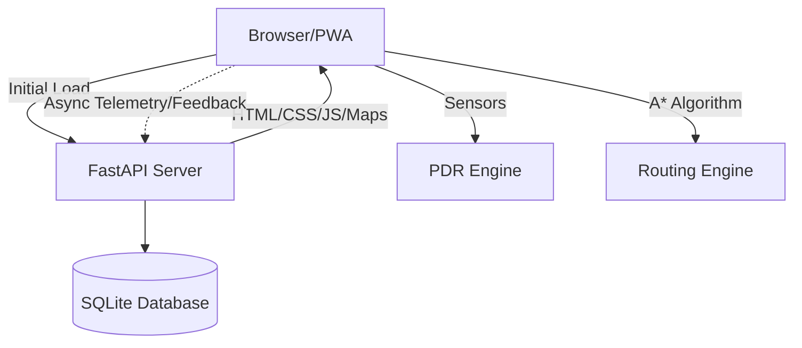

# Architecture

## Full System Architecture
NMIT Wayfinder uses a "Thick Client / Thin Server" architecture. Because indoor spaces often suffer from poor cellular reception, the system is designed as an offline-first Progressive Web App (PWA). The heavy lifting (pathfinding and sensor processing) occurs entirely on the user's device, while the backend serves primarily for initial asset delivery, data aggregation, and telemetry synchronization.

## Major Modules
### Frontend
1. **Routing Engine (`routing.js`):** Implements bidirectional A* search using the pre-loaded static graph data.
2. **PDR Engine (`pdr.js`):** Integrates with device accelerometer and compass APIs to track movement without GPS.
3. **PWA Service Worker:** Caches all UI assets, scripts, and floor map images for offline availability.

### Backend
1. **Graph Definition (`backend/graph/`):** Contains the ground truth nodes, edges, and base weights. 
2. **Telemetry API (`backend/routers/`):** Receives background uploads of session starts, checkpoints, and PDR data.
3. **Admin Panel:** Jinja2-rendered interface for administrators to view stats, manage FAQs, and adjust edge multipliers.

## Data Flow
1. **Initialization:** User visits `/`. Service Worker caches assets. Graph data is embedded in the JS context.
2. **Pathfinding:** User selects start/end nodes. JS calculates the path and displays the SVG polyline.
3. **Navigation:** PDR engine tracks steps and compass heading, snapping to the nearest valid graph edge.
4. **Telemetry:** As the user reaches checkpoints, asynchronous POST requests log the data to `/session/checkpoint`.
5. **Feedback:** Upon completion, the user submits a star rating. This data triggers an adjustment of the edge weights for future routing.

## Dependency Relationships
- **FastAPI** -> **SQLite** (via `db.py`)
- **Jinja2 Templates** -> **Static Assets** (JS/CSS/PNGs)
- **PDR/Routing** -> **Graph Data** (Statically provided)
